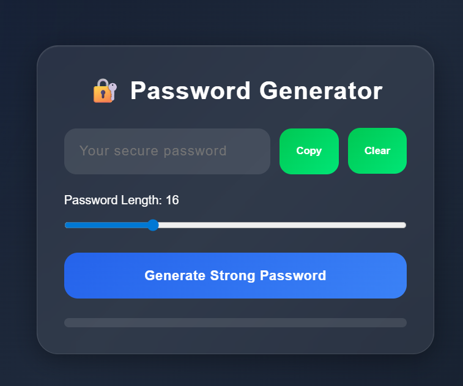

# 🔐 Professional Password Generator

A modern and responsive password generator website built using Python Flask, HTML, CSS, and JavaScript.

## ✨ Features

- Generate strong secure passwords
- Uppercase, lowercase, numbers, and symbols
- Password strength checker
- Copy password button
- Clear password button
- Responsive modern UI
- Glassmorphism design
- Mobile friendly

---

## 🚀 Technologies Used

- Python
- Flask
- HTML5
- CSS3
- JavaScript

---

## 📂 Project Structure

```bash
password-generator/
│
├── app.py
├── requirements.txt
│
├── templates/
│   └── index.html
│
└── static/
    ├── style.css
    ├── screenshort.png
    └── script.js
```

---

## ⚙️ Installation

### 1. Clone Repository

```bash
git clone https://github.com/your-username/password-generator.git
```

### 2. Open Project Folder

```bash
cd password-generator
```

### 3. Install Requirements

```bash
pip install -r requirements.txt
```

### 4. Run Flask App

```bash
python app.py
```

---

## 🌐 Open In Browser

```bash
http://127.0.0.1:5000
```

---

## 📸 Screenshot



---